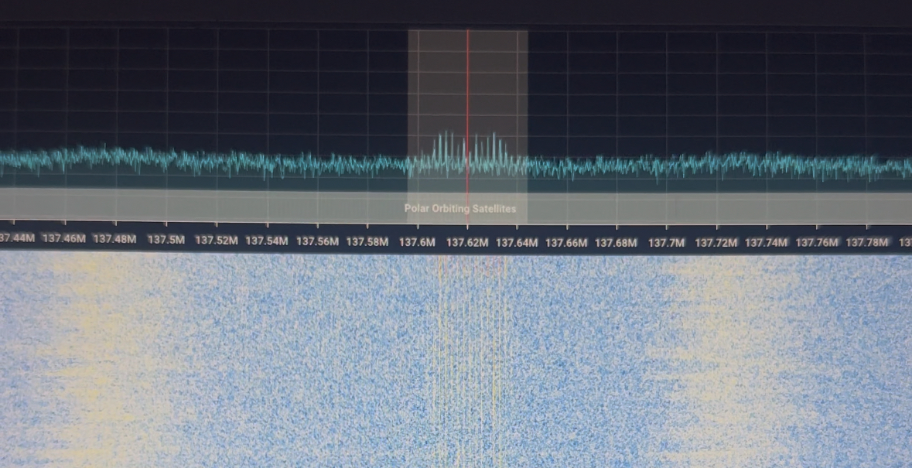

# Caleb's Introduction to SDR
This is going to by a blog style repo where I mess around and try to learn how SDR works. No promises that anything works! I'm kind of an idiot and never do anything right the first time (or the second or the third...).

# Installs
Installs that I followed to get software.

## Gqrx
To install gqrx, I ran the commands found [here](https://www.gqrx.dk/download/gqrx-sdr-for-the-raspberry-pi).

Or,
```bash
sudo apt-get update
sudo apt-get install -y cmake gnuradio-dev gr-osmosdr qt6-base-dev qt6-svg-dev qt6-wayland libasound2-dev libjack-jackd2-dev portaudio19-dev libpulse-dev
git clone https://github.com/gqrx-sdr/gqrx.git
cd gqrx/
mkdir build
cd build
cmake ..
make
sudo make install
```

Then, to make sure it was successfully installed, I ran `gqrx` and I think it worked.

## SDR++
### First attempt
I tried installing SDR++, but I couldn't figure out how to do it from the main github. I'll come back to this later, but for now I will look in to gqrx.
###  Second attempt with [this](https://www.aaronrombaut.com/build-sdr-on-raspberry-pi-5/)

Ran:
```sh
sudo apt install -y cmake libad9361-dev libairspy-dev libairspyhf-dev libfftw3-dev libglfw3-dev libhackrf-dev libiio-dev librtaudio-dev libvolk2-dev libzstd-dev
```

Got the following error:
```bash
Errors were encountered while processing:
 xtrx-dkms
E: Sub-process /usr/bin/dpkg returned an error code (1)
```

I ignored this and continued to build SDR++:
```bash
cd ~/Downloads
wget https://github.com/AlexandreRouma/SDRPlusPlus/archive/refs/heads/master.zip
unzip master.zip
cd ~/Downloads/SDRPlusPlus-master
mkdir build
cd build
cmake ..
make -j4
```

This actually worked just fine so then I moved onto installing SDR++
```bash
## This creates a root?
cd ..
sh ~/Downloads/SDRPlusPlus-master/create_root.sh

## The actual installation
cd ~/Downloads/SDRPlusPlus-master/build
sudo make install
```

Tested to see if it succesfully installed by running:
```bash
sdrpp
```
IT WORKED!!

# Blog!
I'm just going to note keep here diary style. These notes are really for my reference.
 
3/9/2025
---
After messing around with SDR++ and my RTL-SDR, I started to lose faith in my fix. I can't seem to get any signal out from my antenna. When using gqrx, I was able to at least get some FM stations. I'll look into this some more and see what my issues might be.

3/12/2025
---
I decided to try and debug by installing SDR++ on my windows machine to see if that worked any better. I am using Windows Subsystem for Linux (WSL) to do this. I was able to successfully install the necessary drivers + SDR++ + gqrx. I'll give this a try and see if I can get SDR++ to work with my RTL-SDR.

3/15/2025
---
I still haven't tested the SDR++ build on my windows machine, but I went testing it with my Raspberry Pi 5. I was actually able to find the FM radio stations! Just like in gqrx, they are in the wrong place (at around 50 MHz). I think I installed the RTL-SDR drivers incorrectly on the Pi 5, so now I'll see if they will work on my windows machine. Most people seem to be using the Pi 4, because of all of these Pi 5 issues, but I will keep trying!

I also saw a guy with a handheld SDR hanging walking around Boulder yesterday. I should have asked him for advice.

3/19/2025
---
I tried using WSL with all of the drivers installed by following the Linux commands on the [RTL-SDR Quickstart Guide](https://www.rtl-sdr.com/V4/). I learned that WSL doesn't really work with USB devices without quite a bit of work. I just followed the regular Windows installation instructions, so that I can go ahead and give it another go later.                        
BAM! Got it to work in SDR++ using the Windows install instructions. The FM signals are now in the frequency range they should be in!

3/21/2025
---
I have been messing with the SDR a lot more lately. I have been mapping out different signals in SDR++. I briefly tried to see if I could see any of the NOAA satellites and I was actually able to do it! I found NOAA 15 at the perfect time. I used a dipole antenna setup like [this](https://www.rtl-sdr.com/simple-noaameteor-weather-satellite-antenna-137-mhz-v-dipole/)!

Here's an image that I got of the data!



I might try and use WXtoImg to decode the data, but I can't imagine it was good enough for that. The signal was pretty weak so I might buy an LNA to improve this. Stoked that I got this to work!!

